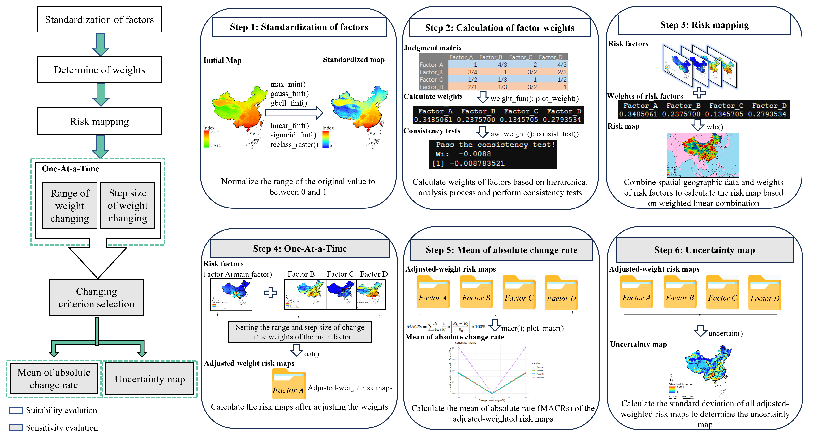
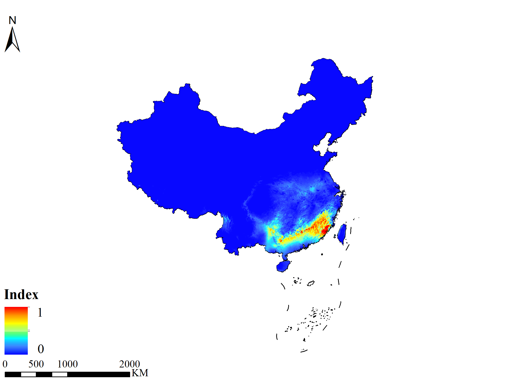
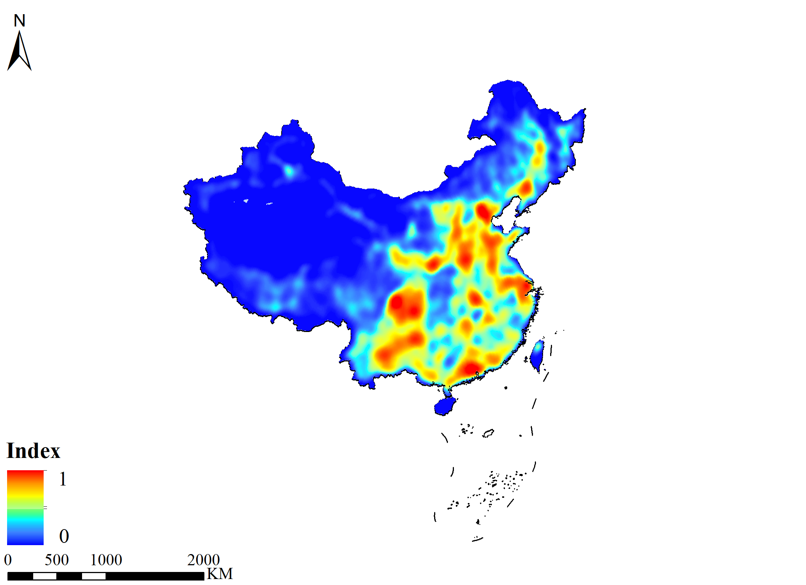
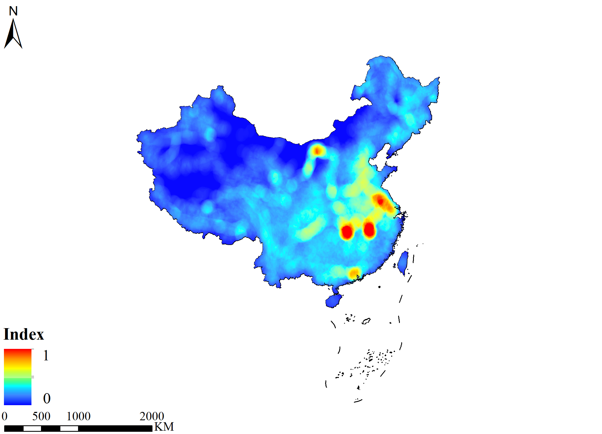
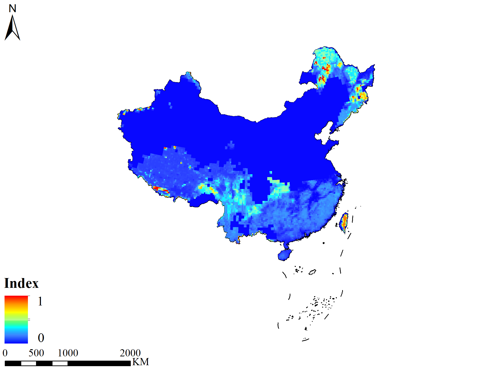
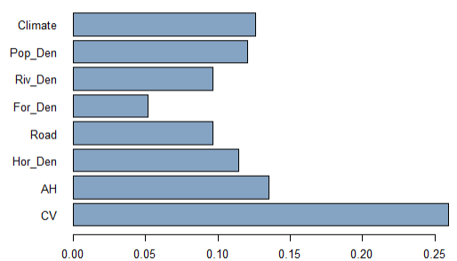
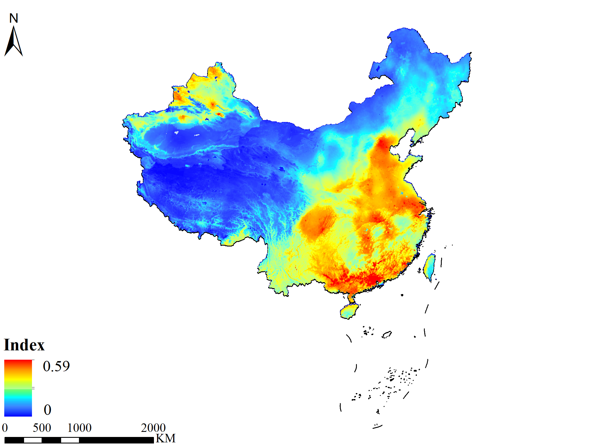

# SpatMCDA

# Getting Started

So you are interested in using **SpatMCDA** to assess risk areas for infectious diseases! That is Great. **SpatMCDA** is an R package based on spatial multi-criteria decision analysis (MCDA) for assessing risk areas of infectious diseases in the absence of reliable data (such as for some emerging and re-emerging infectious diseases).

In this tutorial, I am going to assume that you are seen the main paper and the **SpatMCDA** package vignette, which describes the basic functions and workflow of the package.

```r
library(SpatMCDA)                                                           
```



Fig. 1 Generalized flowchart of SpatMCDA, showing each of thepackage’s main  functions and example outputs

Now, I am going to map the risk of West Nile Virus (WNV) in China by using SpatMCDA to better explain the function and workflow of SpatMCDA.

# Study framework

Fig.2 shows the framework of this study with the following steps:

1. Before using SpatMCDA, we used Web of Science, PubMed, and Google Scholar to select and evaluate risk factors associated with WNV transmission and outbreaks. The selected risk factors were classified and scored using the five-Likert scale. Subsequently, spatial geographic data on risk factors were mapped.
2. SpatMCDA was used to standardize risk factors with values not ranging from 0 to 1.
3. SpatMCDA was used to calculate the weights of the risk factors.
4. SpatMCDA was used to map risk areas for MNV in China.
5. SpatMCDA was used to perform sensitivity and uncertainty analyses on the risk maps.
    
    
    

Fig. 2 Study framework of WNV risk areas in China based on SpatMCDA

# Selection of risk factors

A set of impact variables associated with four explanatory factors (vector, host, climate, transportation and ecosystem) was used. These factors may influence the distribution of WNV cases to identify favorable areas for WNV infection in China (Table 1).

| Type | Factor | References |
| --- | --- | --- |
| Competent vectors | Culex pipiens pallens | [1] |
|  | Culex pipiens quinquefasciatus | [1] |
|  | Aedes albopictus | [2] |
| Amplifying hosts | Corvus corone | [3] |
|  | Corvus macrorhynchos | [4] |
|  | Corvus frugilegus | [3] |
|  | Corvus monedula | [5] |
| Dead-end hosts | Population density | [6] |
|  | Horse density | [7] |
| Cliamate factors | Climatic Suitability for WNV in China | [6] |
| Transportation | Railroad density | [8] |
|  | Highway density | [8] |
| Ecosystem | River density | [9] |
|  | Forest land | [10] |

# Mapping and standardizing risk factors

## Competent vectors

In this section, we used the Species Distribution Models (SDMs) to map the distribution of WNV competent vectors in China.

We collected distribution records of three WNV competent vectors widely distributed in China: *Culex pipiens pallens*, *Culex pipiens quinquefasciatus*, and *Aedes albopictus*. Distribution records of these species **were obtained from two sources: (1) The Global Biodiversity Information Facility (GBIF) database (https://www.gbif.org/), and (2) literature providing detailed occurrence records and coordinates. Initially, 393 occurrence records for *Culex pipiens pallens*, 237 occurrence records for *Culex pipiens quinquefasciatus,* and 205 occurrence records for *Aedes albopictus* were obtained. To correct for sampling bias, distribution data for both species were spatially filtered using ArcGIS 10.2 to ensure that there was only one distribution record within a grid cell (~4.65 km × 4.65 km).

Nineteen bioclimatic factors were used to model the distribution of WNV competent vectors (**Table 1**). These variables were obtained from the World Climate Dataset ([https://www.worldclim.org/](https://www.worldclim.org/)).  

The Bayesian Additive Regression Trees (BARTs) model was used  to predict the distribution of WNV competent vectors. Most of the popular SDMs have obvious limitations in handling uncertainty. In this context, Carlson developed the BART species distribution models in 2020 [11]. BART uses the concepts of classification tree methods and intuitively handles model uncertainty by combining Bayesian methods, making BART a promising alternative to boosted regression trees (BRTs) [11]. The BART model, like other models, such as BRTs and Maximum Entropy, requires pseudo-absences. According to Carlson’s approach, ArcGIS 10.2 was used to randomly generate an equal number of pseudo-absences as global presence points for model establishment [11]. Finally, the “embarcadero” R package (v1.2.0.1003) was used to build the BART model [11]. In the modeling, “embarcadero” includes an automatic variable selection procedure in the “variable.step” function. This procedure will drop every variable with decreasing importance in models with fewer trees (*m* = 10 or 20) and conserve every variable with increasing importance. Specific procedures for the operation of BARTs can be found in the literature [11].

Fig.3 shows the predicted distributions of WNV competent vectors in China. The predictions are probability values between 0-1 and do not require further standardization.


Fig. 3 Potential distribution of WNV competent vectors (*Culex pipiens pallens*, *Culex pipiens quinquefasciatus*, and *Aedes albopictus*) in China.

 Table 1 Variables used in the model

| Bioclimate | Description |
| --- | --- |
| Bio01 | Annual mean temperature |
| Bio02 | Mean diurnal temperature range |
| Bio03 | Isothermality |
| Bio04 | Temperature seasonality |
| Bio05 | Max temperature of the warmest month |
| Bio06 | Min temperature of the coldest month |
| Bio07 | Annual temperature range |
| Bio08 | Mean temperature of the wettest quarter |
| Bio09 | Mean temperature of the driest quarter |
| Bio10 | Mean temperature of the warmest quarter |
| Bio11 | Mean temperature of the coldest quarter |
| Bio12 | Annual precipitation |
| Bio13 | Precipitation of the wettest month |
| Bio14 | Precipitation of the driest month |
| Bio15 | Precipitation seasonality |
| Bio16 | Precipitation of the wettest quarter |
| Bio17 | Precipitation of the driest quarter |
| Bio18 | Precipitation of the warmest quarter |
| Bio19 | Precipitation of the coldest quarter |

## Amplifying hosts

Corvids are often considered to be important hosts for WNV. In this section, we used the same methodology as in the "Competent vectors" section to map the distribution of WNV amplifying hosts in China.

We collected distribution records for four WNV amplifying hosts that are widely distributed in China: *Corvus corone*, *Corvus macrorhynchos*, *Corvus frugilegus*, and *Corvus monedula*. Distribution records were obtained from two sources: (1) The China Birdwatching Center ([http://m.x2fwww.birdreport.cn/index.html](http://m.x2fwww.birdreport.cn/index.html)),  and (2) literature providing detailed occurrence records and coordinates. Initially, 2778 presence records for *Corvus corone*, 4699 presence records for *Corvus macrorhynchos,* 812 presence records for *Corvus frugilegus*, and 979 presence records for *Corvus monedula* were obtained. To correct for sampling bias, the distribution data was spatially filtered using ArcGIS 10.2 to retain only one record per 4.65 km x 4.65 km grid cell.

The same Bayesian Additive Regression Trees (BART) species distribution model and 19 bioclimatic variables used in the "Competent Vectors" section were used to predict the distributions of the WNV amplifying hosts in China.

Fig.4 shows the predicted distributions of WNV amplifying hosts in China. The predictions are probability values between 0-1 and do not require further standardization.


Fig. 4 Potential distribution of WNV amplifying hosts (*Corvus corone*, *Corvus macrorhynchos*, *Corvus frugilegus*, and *Corvus monedula*) in China.

## Dead-end hosts

Population densities were obtained from the  Socioeconomic Data and Applications Center ([https://sedac.ciesin.columbia.edu/](https://sedac.ciesin.columbia.edu/)). Horse densities were obtained from the Food and Agriculture Organization of the United Nations ([https://www.fao.org/home/zh/](https://www.fao.org/home/zh/)).

Figure 5 shows the distribution of WNV Dead-end hosts (population and horses) in China. There is no need to standardize these factors as the factor values range from 0-1.


Fig. 5 Population density and horse density in China.

## Cliamate factors

To date, there have been no documented outbreaks or records of WNV in China. Therefore, we used the WNV occurrence records in Europe and Africa along with 19 climatic variables to construct a BART model and projected it onto China.

The WNV occurrence records were obtained from the Emergency Prevention System for Transboundary Animal and Plant Pests and Diseases (EMPRES) of the Food and Agriculture Organization of the United Nations (FAO) for the time period 2010-2022. 317 records of WNV occurrences in Europe and Africa were obtained.

Fig.6 shows the distribution and environmental suitability for WNV in Europe and Africa. We then projected this model onto China to predict areas environmentally suitable for potential WNV transmission. The climatic suitability for WNV in China is shown in Fig.7. The predictions are probability values between 0-1 and do not require further standardization.


Fig. 6 Climatic suitability for WNV in Europe and Africa.



Fig. 7 Climatic suitability for WNV in China.

## Transportation

Data on the distribution of railroads and highways in China were obtained from the National Geomatics Center of China ([http://www.ngcc.cn/ngcc/](http://www.ngcc.cn/ngcc/)). The kernel density estimation (KDE) was used to calculate the densities of railroads and highways in China.

Subsequently, we normalized the road density using the sigmoid function:

```r
road <- raster::raster("road.tif")
sd_road <- SpatMCDA::sigmoid_fmf(raster = road,a = 0.1,c = 15)
plot(sd_road[[1]])
```

Fig.8 shows the distribution of major roads in China after standardization.



Fig. 8 Map of major road density with standardization.

## Ecosystem

Data on the distribution of rivers in China were obtained from the National Geographic Information Center of China ([http://www.ngcc.cn/ngcc/](http://www.ngcc.cn/ngcc/)). The KDE was used to calculate the density of rivers in China. 

Subsequently, we normalized the river density using the sigmoid function:

```r
river <- raster::raster("river.tif")
sd_river <- SpatMCDA::sigmoid_fmf(raster = river,a = 0.1,c = 12)
plot(sd_river[[1]])
```

Fig.9 shows the density of rivers in China after standardization.



Fig. 9 Map of river density with standardization.

The distribution of forest land in China was obtained from the Land-Use Harmonization (LUH2) database ([http://luh.umd.edu](http://luh.umd.edu/)). Fig.10 shows the distribution of forest land in China. Standardization of this factor was unnecessary since its values ranged from 0-1.



Fig. 10 Distribution of forest land in China

# Calculation of factor weights

After standardizing the factors, we obtained spatial geographic data for eight risk factors across China, including competent vectors, amplifying hosts, dead-end hosts (population density and horse density), climate suitability for WNV in China, major road density, river density, and forest land coverage. All factors had a spatial resolution of 2.5 arcminutes.

Analytic hierarchical process (AHP) was used to determine the weights of risk factors. The hierarchical structure of WNV risk areas assessment was divided into a target layer, a criterion layer, and an index layer. The factors were grouped according to their characteristics. The elements of the same level were dominated by the elements of the previous level. It dominated certain elements of the next level (Fig. 11). The judgment matrix was constructed by comparing the importance of all factors at each level using a 9-level scale. “1” means that the two elements are of equal importance; “3” means that the former is moderately important than the latter; “5” means that the former is strongly important than the latter; “7” means that the former is very strongly important than the latter; “9” indicates that the former is extremely important than the latter; 2, 4, 6 and 8 are the intermediate values of the above judgments.


Fig. 10 The hierarchical structure of WNV risk areas assessment.

10 epidemiologists (5 PhDs and 5 MSc) gave their opinion on the importance of comparing pairs of factors on a nine-point scale using a pairwise comparison matrix. The results of the pairwise comparison matrix are shown in Table 2.

 Table 2 The pairwise comparison matrix

|  | CV | AH | Hor_Den | Road | For_Den | Riv_Den | Pop_Den | Climate |
| --- | --- | --- | --- | --- | --- | --- | --- | --- |
| CV | 1     | 5     | 3     | 3     | 5     | 3     | 1     | 1     |
| AH | 1/5 | 1     | 2     | 2     | 4     | 1     | 1     | 1     |
| Pop_Den | 1/3 | 1/2 | 1     | 1     | 3     | 2     | 1     | 1     |
| Hor_Den | 1/3 | 1/2 | 1     | 1     | 2     | 1     | 1     | 1     |
| Climate | 1/2 | 1/5 | 1/3 | 1/2 | 1     | 1/2 | 1/2 | 1/3 |
| Road | 1/3 | 1     | 1/2 | 1     | 2     | 1     | 1     | 1     |
| River_Den | 1     | 1     | 1     | 1     | 2     | 1     | 1     | 1     |
| DIS_LI | 1     | 1     | 1     | 1     | 3     | 1     | 1     | 1     |

Next, we used SpatMCDA to perform AHP to calculate the weights of the factors.

```r
> matrix <- readxl::read_excel("matrix.xlsx")
> matrix
# A tibble: 8 × 8
     CV    AH Hor_Den  Road For_Den Riv_Den Pop_Den Climate
  <dbl> <dbl>   <dbl> <dbl>   <dbl>   <dbl>   <dbl>   <dbl>
1 1       5     3       3         5     3       1     1    
2 0.2     1     2       2         4     1       1     1    
3 0.333   0.5   1       1         3     2       1     1    
4 0.333   0.5   1       1         2     1       1     1    
5 0.5     0.2   0.333   0.5       1     0.5     0.5   0.333
6 0.333   1     0.5     1         2     1       1     1    
7 1       1     1       1         2     1       1     1    
8 1       1     1       1         3     1       1     1  
> ahp <- SpatMCDA::weight_fun(data = matrix)
> ahp$weight_factor
        CV         AH    Hor_Den       Road    For_Den    Riv_Den    Pop_Den    Climate 
0.25955563 0.13515146 0.11417643 0.09658984 0.05158787 0.09636136 0.12044779 0.12612961 
> SpatMCDA::plot_weight(ahp$weight_factor)

```



In this process, we obtained the weights of the eight risk factors. Subsequently we need to perform a consistency test on the pairwise comparison matrix.

```r
> #Compute the eigenvector λ
> aw <- SpatMCDA::aw_weight(data = matrix)
> aw
$AW_Vector
             [,1]
CV      2.3612126
AH      1.1578854
Hor_Den 0.9589243
Road    0.8109751
For_Den 0.4451975
Riv_Den 0.8214626
Pop_Den 1.0515879
Climate 1.1031757

$`∑AW/W`
            [,1]
CV      9.097135
AH      8.567317
Hor_Den 8.398619
Road    8.396070
For_Den 8.629887
Riv_Den 8.524813
Pop_Den 8.730653
Climate 8.746366

$λ
[1] 8.636357

> SpatMCDA::consist_test(λ = 8.6,n = 8)
[1] "The reference values for RI (1-15 factor reference) are 0,0,0.52,0.89,1.12,1.26,1.36,1.41,1.46,1.49,1.52,1.54,1.56,1.58,1.59"
 Pass the consistency test!
 Wi:  0.0608 
[1] 0.06079027
```

Congratulations, our pairwise comparison matrix passes the consistency test. Next, we are going to map the WNV risk in China.

# Risk Mapping

After obtaining spatial geographic data for all risk factors and their weights, we will use the weighted linear combination to map WNV risk in China.

```r
#Loading raster data for risk factors.
#Note: the order of the raster needs to be consistent with its weights
rasters <- raster::stack(
  "CV.tif",
  "AH.tif",
  "Hor_Den.tif",
  "Road.tif",
  "For_Den.tif",
  "Riv_Den.tif",
  "Pop_Den.tif",
  "Climate.tif")
weights <- c(0.26,0.135,0.114,0.097,0.052,0.096,0.120,0.126)
risk_map <- wlc(rasters = rasters,weight = weights)
raster::plot(risk_map)
```



# One-At-a-Time

Next, we perform the sensitivity analysis of the risk map using One-At-a-Time.

```r
> # as the main factor
> rasters <- raster::stack(
   "CV.tif",
   "AH.tif",
   "Hor_Den.tif",
   "Road.tif",
   "For_Den.tif",
   "Riv_Den.tif",
   "Pop_Den.tif",
   "Climate.tif")
> #The order of the weights is aligned with the order of the rasters
> weights <- c(0.26,0.135,0.114,0.097,0.052,0.096,0.120,0.126)
> #Range of weight adjustment (%)
> range <- c(-20,20)
> #Step size of weight adjustment (%)
> step <- 1
> #All results are output in out_dir
> oat(rasters = rasters,weights = weights,
      range = range,step = step,output_dir = "oat//1_CV")
#Note: result_-20 =  Results at -20% change in weights
[1] "oat//1_CV/result_-20.tif"
[1] "oat//1_CV/result_-19.tif"
[1] "oat//1_CV/result_-18.tif"
[1] "oat//1_CV/result_-17.tif"
[1] "oat//1_CV/result_-16.tif"
[1] "oat//1_CV/result_-15.tif"
[1] "oat//1_CV/result_-14.tif"
[1] "oat//1_CV/result_-13.tif"
[1] "oat//1_CV/result_-12.tif"
[1] "oat//1_CV/result_-11.tif"
[1] "oat//1_CV/result_-10.tif"
[1] "oat//1_CV/result_-9.tif"
[1] "oat//1_CV/result_-8.tif"
[1] "oat//1_CV/result_-7.tif"
[1] "oat//1_CV/result_-6.tif"
[1] "oat//1_CV/result_-5.tif"
[1] "oat//1_CV/result_-4.tif"
[1] "oat//1_CV/result_-3.tif"
[1] "oat//1_CV/result_-2.tif"
[1] "oat//1_CV/result_-1.tif"
[1] "oat//1_CV/result_0.tif"
[1] "oat//1_CV/result_1.tif"
[1] "oat//1_CV/result_2.tif"
[1] "oat//1_CV/result_3.tif"
[1] "oat//1_CV/result_4.tif"
[1] "oat//1_CV/result_5.tif"
[1] "oat//1_CV/result_6.tif"
[1] "oat//1_CV/result_7.tif"
[1] "oat//1_CV/result_8.tif"
[1] "oat//1_CV/result_9.tif"
[1] "oat//1_CV/result_10.tif"
[1] "oat//1_CV/result_11.tif"
[1] "oat//1_CV/result_12.tif"
[1] "oat//1_CV/result_13.tif"
[1] "oat//1_CV/result_14.tif"
[1] "oat//1_CV/result_15.tif"
[1] "oat//1_CV/result_16.tif"
[1] "oat//1_CV/result_17.tif"
[1] "oat//1_CV/result_18.tif"
[1] "oat//1_CV/result_19.tif"
[1] "oat//1_CV/result_20.tif"

```


Subsequently, we used amplifying hosts (AH) as the most dominant factor to calculate the risk maps after adjusting the weights.

```r
> #amplifying hosts(AH) as the main factor
> rasters <- raster::stack(
   "AH.tif",
   "CV.tif",
   "Hor_Den.tif",
   "Road.tif",
   "For_Den.tif",
   "Riv_Den.tif",
   "Pop_Den.tif",
   "Climate.tif")
> #The order of the weights is aligned with the order of the rasters
> weights <- c(0.135,0.26,0.114,0.097,0.052,0.096,0.120,0.126)
> #Range of weight adjustment (%)
> range <- c(-20,20)
> #Step size of weight adjustment (%)
> step <- 1
> #All results are output in out_dir
> oat(rasters = rasters,weights = weights,
      range = range,step = step,output_dir = "oat//2_AH")
[1] "oat//2_AH/result_-20.tif"
[1] "oat//2_AH/result_-19.tif"
[1] "oat//2_AH/result_-18.tif"
[1] "oat//2_AH/result_-17.tif"
[1] "oat//2_AH/result_-16.tif"
[1] "oat//2_AH/result_-15.tif"
[1] "oat//2_AH/result_-14.tif"
[1] "oat//2_AH/result_-13.tif"
[1] "oat//2_AH/result_-12.tif"
[1] "oat//2_AH/result_-11.tif"
[1] "oat//2_AH/result_-10.tif"
[1] "oat//2_AH/result_-9.tif"
[1] "oat//2_AH/result_-8.tif"
[1] "oat//2_AH/result_-7.tif"
[1] "oat//2_AH/result_-6.tif"
[1] "oat//2_AH/result_-5.tif"
[1] "oat//2_AH/result_-4.tif"
[1] "oat//2_AH/result_-3.tif"
[1] "oat//2_AH/result_-2.tif"
[1] "oat//2_AH/result_-1.tif"
[1] "oat//2_AH/result_0.tif"
[1] "oat//2_AH/result_1.tif"
[1] "oat//2_AH/result_2.tif"
[1] "oat//2_AH/result_3.tif"
[1] "oat//2_AH/result_4.tif"
[1] "oat//2_AH/result_5.tif"
[1] "oat//2_AH/result_6.tif"
[1] "oat//2_AH/result_7.tif"
[1] "oat//2_AH/result_8.tif"
[1] "oat//2_AH/result_9.tif"
[1] "oat//2_AH/result_10.tif"
[1] "oat//2_AH/result_11.tif"
[1] "oat//2_AH/result_12.tif"
[1] "oat//2_AH/result_13.tif"
[1] "oat//2_AH/result_14.tif"
[1] "oat//2_AH/result_15.tif"
[1] "oat//2_AH/result_16.tif"
[1] "oat//2_AH/result_17.tif"
[1] "oat//2_AH/result_18.tif"
[1] "oat//2_AH/result_19.tif"
[1] "oat//2_AH/result_20.tif"
```


As shown in the process above, the remaining six factors were sequentially analyzed as principal factors for OAT.  

```r
> #Horse density(Hor_Den) as the main factor
.....
> #Major road density(Road) as the main factor
.....
> #Forest density(For_Den) as the main factor
.....
> #River density(Riv_Den) as the main factor
.....
> #Population density(Pop_Den) as the main factor
.....
> #climatic suitability for WNV in China(Climate) as the main factor
.....
```

# **Mean of absolute change rates**

Next, let's calculate the absolute average rate of change for all factors together!

```r
#Read the results of the One-Factor-a-Time of factor competent vectors(CV)
oat_rasters <- raster::stack(dir("oat//1_CV",full.names = TRUE))
#Read the risk map obtained with the weighted linear combination
wlc_raster <- raster::raster("wlc//risk_map.tif")
#All results are output in out_dir
macr_cattle <- macr(oat_rasters = oat_rasters,wlc_raster = wlc_raster,
                    output_dir = "macr//1_CV")
#result_.1 == result_-1  Results at -1% change in weights
[1] "result_.1"
[1] "0.22%"
[1] "result_.10"
[1] "2.17%"
[1] "result_.11"
[1] "2.39%"
[1] "result_.12"
[1] "2.61%"
[1] "result_.13"
[1] "2.82%"
[1] "result_.14"
[1] "3.04%"
[1] "result_.15"
[1] "3.26%"
[1] "result_.16"
[1] "3.47%"
[1] "result_.17"
[1] "3.69%"
[1] "result_.18"
[1] "3.91%"
[1] "result_.19"
[1] "4.13%"
[1] "result_.2"
[1] "0.43%"
[1] "result_.20"
[1] "4.34%"
[1] "result_.3"
[1] "0.65%"
[1] "result_.4"
[1] "0.87%"
[1] "result_.5"
[1] "1.09%"
[1] "result_.6"
[1] "1.3%"
[1] "result_.7"
[1] "1.52%"
[1] "result_.8"
[1] "1.74%"
[1] "result_.9"
[1] "1.95%"
[1] "result_0"
[1] "0%"
[1] "result_1"
[1] "0.22%"
[1] "result_10"
[1] "2.17%"
[1] "result_11"
[1] "2.39%"
[1] "result_12"
[1] "2.61%"
[1] "result_13"
[1] "2.82%"
[1] "result_14"
[1] "3.04%"
[1] "result_15"
[1] "3.26%"
[1] "result_16"
[1] "3.47%"
[1] "result_17"
[1] "3.69%"
[1] "result_18"
[1] "3.91%"
[1] "result_19"
[1] "4.13%"
[1] "result_2"
[1] "0.43%"
[1] "result_20"
[1] "4.34%"
[1] "result_3"
[1] "0.65%"
[1] "result_4"
[1] "0.87%"
[1] "result_5"
[1] "1.09%"
[1] "result_6"
[1] "1.3%"
[1] "result_7"
[1] "1.52%"
[1] "result_8"
[1] "1.74%"
[1] "result_9"
[1] "1.95%"
```


Subsequently, let's calculate the mean of absolute change rates for amplifying hosts (AH).

```r
#Read the results of the One-Factor-a-Time of factor amplifying hosts (AH)
oat_rasters <- raster::stack(dir("oat//2_AH",full.names = TRUE))
#Read the risk map obtained with the weighted linear combination
wlc_raster <- raster::raster("wlc//risk_map.tif")
#All results are output in out_dir
macr_cattle <- macr(oat_rasters = oat_rasters,wlc_raster = wlc_raster,
                    output_dir = "macr//2_AH")
[1] "result_.1"
[1] "0.32%"
[1] "result_.10"
[1] "3.2%"
[1] "result_.11"
[1] "3.52%"
[1] "result_.12"
[1] "3.84%"
[1] "result_.13"
[1] "4.16%"
[1] "result_.14"
[1] "4.48%"
[1] "result_.15"
[1] "4.8%"
[1] "result_.16"
[1] "5.12%"
[1] "result_.17"
[1] "5.44%"
[1] "result_.18"
[1] "5.76%"
[1] "result_.19"
[1] "6.08%"
[1] "result_.2"
[1] "0.64%"
[1] "result_.20"
[1] "6.4%"
[1] "result_.3"
[1] "0.96%"
[1] "result_.4"
[1] "1.28%"
[1] "result_.5"
[1] "1.6%"
[1] "result_.6"
[1] "1.92%"
[1] "result_.7"
[1] "2.24%"
[1] "result_.8"
[1] "2.56%"
[1] "result_.9"
[1] "2.88%"
[1] "result_0"
[1] "0%"
[1] "result_1"
[1] "0.32%"
[1] "result_10"
[1] "3.2%"
[1] "result_11"
[1] "3.52%"
[1] "result_12"
[1] "3.84%"
[1] "result_13"
[1] "4.16%"
[1] "result_14"
[1] "4.48%"
[1] "result_15"
[1] "4.8%"
[1] "result_16"
[1] "5.12%"
[1] "result_17"
[1] "5.44%"
[1] "result_18"
[1] "5.76%"
[1] "result_19"
[1] "6.08%"
[1] "result_2"
[1] "0.64%"
[1] "result_20"
[1] "6.4%"
[1] "result_3"
[1] "0.96%"
[1] "result_4"
[1] "1.28%"
[1] "result_5"
[1] "1.6%"
[1] "result_6"
[1] "1.92%"
[1] "result_7"
[1] "2.24%"
[1] "result_8"
[1] "2.56%"
[1] "result_9"
[1] "2.88%"
```


As shown in the process above, MACRs were calculated for each of the remaining six factors as shown in the process above.

```r
> #Calculating MACRs for horse density(Hor_Den)
.....
> #Calculating MACRs for major road density(Road) 
.....
> #Calculating MACRs for forest density(For_Den)
.....
> #Calculating MACRs for river density(Riv_Den)
.....
> #Calculating MACRs for population density(Pop_Den)
.....
> #Calculating MACRs for climatic suitability for WNV in China(Climate)
.....
```

Let's plot the values of the MACRs for all factors together next!

```r
MACR_Data <- readxl::read_excel(allfactor_MACR.xlsx")
plot_macr(MACR_Data)
```


# Uncertainty map

Finally, let's put together all the risk maps (all the maps in the “oat” folder) with adjusted weights. Let's calculate the uncertainty map.

```r
rasters <- terra::rast(dir("//uncertainty_map",full.names = TRUE))
unceratin_map <- uncertain(rasters)
terra::plot(unceratin_map)
```


# **References**

[1] Hamer G L, Kitron U D, Brawn J D, et al. Culex pipiens (Diptera: Culicidae): a bridge vector of West Nile virus to humans[J]. Journal of medical entomology, 2008, 45(1): 125-128.

[2] Sardelis M R, Turell M J, O'Guinn M L, et al. Vector competence of three North American strains of Aedes albopictus for West Nile virus[J]. Journal of the American Mosquito Control Association, 2002, 18(4): 284-289.

[3] Hubalek Z. European experience with the West Nile virus ecology and epidemiology: could it be relevant for the New World?[J]. Viral Immunology, 2000, 13(4): 415-426.

[4] Shirafuji H, Kanehira K, Kubo M, et al. Experimental West Nile virus infection in jungle crows (Corvus macrorhynchos)[J]. The American journal of tropical medicine and hygiene, 2008, 78(5): 838-842.

[5] Sotelo E, Llorente F, Rebollo B, et al. Development and evaluation of a new epitope-blocking ELISA for universal detection of antibodies to West Nile virus[J]. Journal of virological methods, 2011, 174(1-2): 35-41.

[6] García-Carrasco J M, Muñoz A R, Olivero J, et al. An African West Nile virus risk map for travellers and clinicians[J]. Travel Medicine and Infectious Disease, 2023, 52: 102529.

[7] Gonzálvez M, Franco J J, Barbero-Moyano J, et al. Monitoring the epidemic of West Nile virus in equids in Spain, 2020–2021[J]. Preventive Veterinary Medicine, 2023, 217: 105975.

[8] Ulbert S. West Nile virus vaccines–current situation and future directions[J]. Human Vaccines & Immunotherapeutics, 2019, 15(10): 2337-2342.

[9] Komar N, Clark G G. West Nile virus activity in Latin America and the Caribbean[J]. Revista Panamericana de Salud Publica, 2006, 19(2): 112-117.

[10] Rappole J H, Derrickson S R, Hubalek Z. Migratory birds and spread of West Nile virus in the Western Hemisphere[J]. Emerging infectious diseases, 2000, 6(4): 319.

[11] Carlson C J. embarcadero: Species distribution modelling with Bayesian additive regression trees in r[J]. Methods in Ecology and Evolution, 2020, 11(7): 850-858.

[12] Wang H, Xiao J, Ouyang M, et al. Assessment of foot-and-mouth disease risk areas in mainland China based spatial multi-criteria decision analysis[J]. BMC Veterinary Research, 2021, 17: 1-12.
