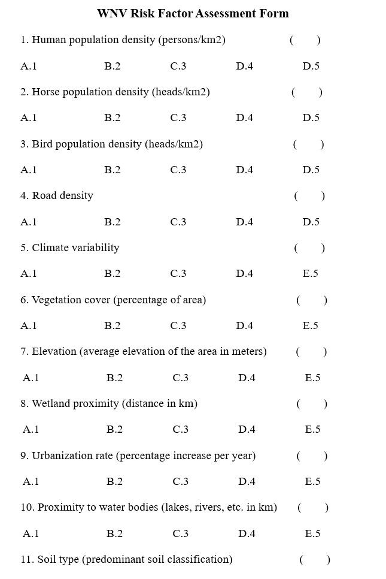
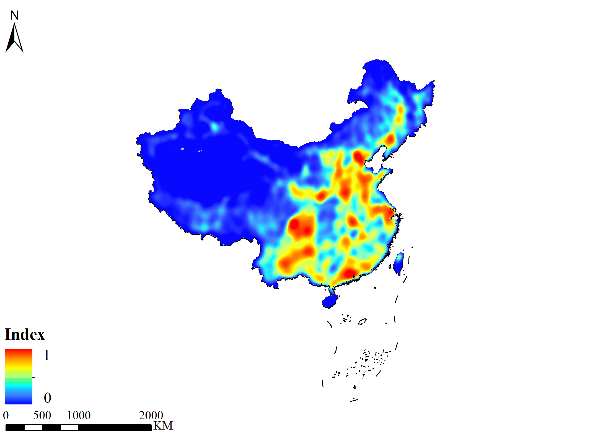

# Mapping the risk of West Nile virus in China with SpatMCDA

# Getting Started

So you're interested in using **SpatMCDA** to assess risk areas for infectious diseases! That's great. **SpatMCDA** is an R package designed for spatial multi-criteria decision analysis (MCDA). It's particularly useful for assessing risk areas of infectious diseases when reliable data are scarce, such as with some emerging or re-emerging infectious diseases.

In this tutorial, I'll assume you've already looked at the main paper and the **SpatMCDA** package vignette, which outlines the basic functions and workflow of the package

``` r
library(SpatMCDA)                                                           
```


Fig. 1 Generalized flowchart of SpatMCDA, showing each of the package's main functions and example outputs

Now, I'm going to demonstrate how to map the risk of West Nile Virus (WNV) in China using **SpatMCDA**. This will help explain the function and workflow of **SpatMCDA** more clearly.

# Study framework

Fig.2 below shows the framework of this study, which includes the following steps:

1.  Before using **SpatMCDA**, we conducted a literature review using Web of Science, PubMed, and Google Scholar to select and evaluate risk factors associated with WNV transmission and outbreaks. The selected risk factors were classified and scored using a five-point Likert scale. Spatial geographic data on these risk factors were then mapped.
2.  We used **SpatMCDA** to standardize these risk factors so that their values ranged from 0 to 1.
3.  **SpatMCDA** was then used to calculate the weights of the risk factors.
4.  Next, **SpatMCDA** was employed to map the risk areas for WNV in China.
5.  Finally, **SpatMCDA** was used to perform sensitivity and uncertainty analyses on the risk maps.


Fig. 2 Study framework of WNV risk areas in China based on SpatMCDA

# Selection of risk factors

Based on the 'One Health' concept, we invited ten epidemiology experts from the fields of veterinary medicine, environmental science, and public health (including five PhDs and five Masters) to participate in the preliminary screening of potential spatial risk factors influencing the transmission of WNV in China. These experts proposed and discussed spatial risk factors they believed could impact WNV spread. After the initial screening was completed, all experts engaged in discussions and rated all proposed risk factors using a Likert five-point scale (Fig. 3). Ultimately, the study identified five major explanatory factors---vectors, hosts, climate, transportation, and ecosystems---which were unanimously considered likely to affect the distribution of WNV in China (Table 1). Additionally, through interviews and discussions with various experts, we constructed a Directed Acyclic Graph (DAG) to explain the causal relationships between different risk factors and WNV transmission (Fig. 4). The relationships are detailed as follows:

**WNV** is central to the transmission process:

-   An arrow from WNV to Competent Vectors (mosquitoes) indicates that the virus initiates its transmission chain by infecting mosquitoes.
-   An arrow from WNV to Amplifying Hosts (birds) signifies that the virus also directly infects birds, making them amplifying hosts for the virus.
-   An arrow from WNV to Dead-end Hosts (humans and horses) demonstrates that the virus can infect humans and horses, although humans and horses do not contribute to further transmission of the virus.

For Competent Vectors (Mosquitoes), Amplifying Hosts (birds), and Dead-end Hosts (Humans and horses):

**Competent Vectors (Mosquitoes):** These are the primary carriers of the virus.

-   An arrow from Competent Vectors (mosquitoes) to WNV reflects that mosquitoes are not only carriers of the virus, but their population health is also directly impacted by the virus.
-   An arrow from Competent Vectors (mosquitoes) to Amplifying Hosts (Birds), indicates that mosquitoes transmit the virus to birds.
-   An arrow from Competent Vectors (mosquitoes) to Dead-end Hosts (humans and horses) shows that mosquitoes can also directly transmit the virus to humans.

**Amplifying Hosts (Birds):** Birds are amplifying hosts for the virus, helping to propagate the virus and transmit it to other hosts through mosquitoes.

-   An arrow from Amplifying Hosts (birds) to WNV indicates that birds not only spread the virus but may also influence the virus's genetic mutations and adaptability.
-   An arrow from Amplifying Hosts (birds) to Competent Vectors (Mosquitoes) indicates that birds, after being bitten by mosquitoes, make the mosquitoes carriers of the virus to new hosts.

**Dead-end Host:**

-   An arrow from WNV to **Dead-end Hosts** (humans and horses) because humans and horses, while hosts of the virus, do not participate in its transmission.

**Climate Factors:** Climate factors directly affect the living environment and reproduction rate of mosquitoes.

-   An arrow from Climate Factors to Competent Vectors (Mosquitoes) indicates that changes in temperature and rainfall can increase or decrease mosquito populations.

**Transportation:** Transportation facilitates the movement of hosts (including humans and birds) to new areas, thus driving the geographic spread of the virus.

-   An arrow from Transportation to Amplifying Hosts (birds) and Dead-end Hosts (humans and horses) illustrates how transportation helps these hosts move across regions.

**Ecosystem (Landscape and Vegetation):** The composition of the ecosystem impacts the habitats and breeding grounds of mosquitoes.

-   An arrow from Ecosystem to Competent Vectors (Mosquitoes) indicates that different landscapes and types of vegetation have a direct impact on mosquito populations.

It should be noted that in this section, we invited ten experts from different fields to screen risk factors. However, incorporating more expertise from diverse fields could enhance the scope and applicability of the results. This interdisciplinary collaboration integrates various perspectives from the outset, highlighting the true advantages of the 'One Health' approach. Additionally, we recommend creating causal diagrams through interviews with various experts before data collection. This would promote a structured exploration of potential factors, ensuring that factor selection is based on a comprehensive understanding of disease dynamics.

Table 1 Selection of risk factors

| Type              | Factor                                | References |
|-------------------|---------------------------------------|------------|
| Competent vectors | Culex pipiens pallens                 | [1]        |
|                   | Culex pipiens quinquefasciatus        | [1]        |
|                   | Aedes albopictus                      | [2]        |
| Amplifying hosts  | Corvus corone                         | [3]        |
|                   | Corvus macrorhynchos                  | [4]        |
|                   | Corvus frugilegus                     | [3]        |
|                   | Corvus monedula                       | [5]        |
| Dead-end hosts    | Population density                    | [6]        |
|                   | Horse density                         | [7]        |
| Climate factors   | Climatic Suitability for WNV in China | [6]        |
| Transportation    | Railroad density                      | [8]        |
|                   | Highway density                       | [8]        |
| Ecosystem         | River density                         | [9]        |
|                   | Forest land                           | [10]       |



Fig. 3 Expert screening of risk factors using the Likert five-point scale


Fig. 4 Causal relationship between WNV transmission and various risk factors

# Mapping and standardizing risk factors

## Competent vectors

In this section, we used the Species Distribution Models (SDMs) to map the distribution of WNV competent vectors in China.

We collected distribution records of three WNV competent vectors widely distributed in China: *Culex pipiens pallens*, *Culex pipiens quinquefasciatus*, and *Aedes albopictus*. The distribution records of these species \*\*were sourced from two sources: (1) The Global Biodiversity Information Facility (GBIF) database (<https://www.gbif.org/>), and (2) scholarly articles that provided detailed occurrence records and coordinates. Initially, we obtained 393 occurrence records for *Culex pipiens pallens*, 237 for *Culex pipiens quinquefasciatus,* and 205 for *Aedes albopictus*. To correct sampling bias, we spatially filtered the distribution data using ArcGIS 10.2, ensuring only one record per grid cell (approximately 4.65 km × 4.65 km).

We used nineteen bioclimatic variables to model the distribution of the WNV competent vectors (**Table 2**). These variables were obtained from the World Climate Dataset (<https://www.worldclim.org/>). The high correlation between environmental variables reduces the accuracy of the model, so we performed the variance inflation factors (VIF) analysis to eliminate the highly correlated variables. Variables with VIF values \> 10 were considered to have the multicollinearity problem [12]. The "car" package in R was used to analyze VIF.

The Bayesian Additive Regression Trees (BARTs) model was used to predict the distribution of WNV competent vectors. Most of the popular SDMs have obvious limitations in handling uncertainty. In this context, Carlson developed the BART species distribution models in 2020 [11]. BART uses the concepts of classification tree methods and intuitively handles model uncertainty by combining Bayesian methods, making BART a promising alternative to boosted regression trees (BRTs) [11]. The BART model, like other models, such as BRTs and Maximum Entropy, requires pseudo-absences. According to Carlson's approach, ArcGIS 10.2 was used to randomly generate an equal number of pseudo-absences as global presence points for model establishment [11]. Finally, the "embarcadero" R package (v1.2.0.1003) was used to build the BART model [11]. In the modeling, "embarcadero" includes an automatic variable selection procedure in the "variable.step" function. This procedure will drop every variable with decreasing importance in models with fewer trees (*m* = 10 or 20) and conserve every variable with increasing importance. Specific procedures for the operation of BARTs can be found in the literature [11].

Fig.5 shows the predicted distributions of WNV competent vectors in China. These predictions are represented as probability values ranging from 0 to 1 and require no further normalization.


Fig. 5 Potential distribution of WNV competent vectors (*Culex pipiens pallens*, *Culex pipiens quinquefasciatus*, and *Aedes albopictus*) in China.

Table 2 Variables used in the model

| Bioclimate | Description                             |
|------------|-----------------------------------------|
| Bio01      | Annual mean temperature                 |
| Bio02      | Mean diurnal temperature range          |
| Bio03      | Isothermality                           |
| Bio04      | Temperature seasonality                 |
| Bio05      | Max temperature of the warmest month    |
| Bio06      | Min temperature of the coldest month    |
| Bio07      | Annual temperature range                |
| Bio08      | Mean temperature of the wettest quarter |
| Bio09      | Mean temperature of the driest quarter  |
| Bio10      | Mean temperature of the warmest quarter |
| Bio11      | Mean temperature of the coldest quarter |
| Bio12      | Annual precipitation                    |
| Bio13      | Precipitation of the wettest month      |
| Bio14      | Precipitation of the driest month       |
| Bio15      | Precipitation seasonality               |
| Bio16      | Precipitation of the wettest quarter    |
| Bio17      | Precipitation of the driest quarter     |
| Bio18      | Precipitation of the warmest quarter    |
| Bio19      | Precipitation of the coldest quarter    |

## Amplifying hosts

Corvids are often considered significant hosts for WNV. In this section, we apply the same methodology as outlined in the "**Competent Vectors**" section to map the distribution of WNV amplifying hosts in China.

*We compiled distribution records for four widely found WNV amplifying hosts in China: Corvus corone*, *Corvus macrorhynchos*, *Corvus frugilegus*, and *Corvus monedula*. Distribution records were obtained from two sources: The distribution records were sourced from two main places: (1) the China Birdwatching Center ([China Birdwatching Center](http://m.x2fwww.birdreport.cn/index.html)), and (2) scholarly articles providing detailed occurrence records and coordinates. Initially, we gathered 2778 records for *Corvus corone*, 4699 for *Corvus macrorhynchos*, 812 for *Corvus frugilegus*, and 979 for *Corvus monedula*. To mitigate sampling bias, we spatially filtered the data using ArcGIS 10.2 to ensure only one record per grid cell, each measuring 4.65 km by 4.65 km.

We employed the Bayesian Additive Regression Trees (BART) species distribution model, alongside the same 19 bioclimatic variables from the "Competent Vectors" section, to predict the distributions of the WNV amplifying hosts in China. Variables with VIF values \> 10 were considered to have the multicollinearity problem and were removed [12].

Fig.6 shows the predicted distributions of WNV amplifying hosts in China. The predictions are probability values between 0-1 and do not require further standardization.


Fig. 6 Potential distribution of WNV amplifying hosts (*Corvus corone*, *Corvus macrorhynchos*, *Corvus frugilegus*, and *Corvus monedula*) in China.

## Dead-end hosts

Population densities were obtained from the Socioeconomic Data and Applications Center (<https://sedac.ciesin.columbia.edu/>). Horse densities were obtained from the Food and Agriculture Organization of the United Nations (<https://www.fao.org/home/zh/>).

Figure 7 shows the distribution of WNV Dead-end hosts (population and horses) in China. There is no need to standardize these factors as the factor values range from 0-1.


Fig. 7 Population density and horse density in China.

## Cliamate factors

To date, there have been no confirmed outbreaks or records of West Nile Virus (WNV) in China. Consequently, we used WNV occurrence records from Europe and Africa, along with 19 climatic variables, to construct a Bayesian Additive Regression Trees (BART) model and subsequently projected it onto China. Variables with VIF values \> 10 were considered to have the multicollinearity problem and were removed [12].

The WNV occurrence records were obtained from the Emergency Prevention System for Transboundary Animal and Plant Pests and Diseases (EMPRES) of the Food and Agriculture Organization of the United Nations (FAO) for the time period 2010-2022. 317 records of WNV occurrences in Europe and Africa were obtained.

Fig. 8 shows the distribution and environmental suitability for WNV in Europe and Africa. We then projected this model onto China to predict areas environmentally suitable for potential WNV transmission. The climatic suitability for WNV in China is shown in Fig. 9. The predictions are probability values between 0-1 and do not require further standardization.


Fig. 8 Climatic suitability for WNV in Europe and Africa.


Fig. 9 Climatic suitability for WNV in China.

## Transportation

Data on the distribution of railroads and highways in China were obtained from the National Geomatics Center of China (<http://www.ngcc.cn/ngcc/>). The kernel density estimation (KDE) was used to calculate the densities of railroads and highways in China.

Subsequently, we normalized the road density using the sigmoid function:

``` r
road <- raster::raster("road.tif")
sd_road <- SpatMCDA::sigmoid_fmf(raster = road,a = 0.1,c = 15)
plot(sd_road[[1]])
```

Fig. 10 shows the distribution of major roads in China after standardization.



Fig. 10 Map of major road density with standardization.

## Ecosystem

Data on the distribution of rivers in China were obtained from the National Geographic Information Center of China (<http://www.ngcc.cn/ngcc/>). The KDE was used to calculate the density of rivers in China.

Subsequently, we normalized the river density using the sigmoid function:

``` r
river <- raster::raster("river.tif")
sd_river <- SpatMCDA::sigmoid_fmf(raster = river,a = 0.1,c = 12)
plot(sd_river[[1]])
```

Fig.11 shows the density of rivers in China after standardization.


Fig. 11 Map of river density with standardization.

The distribution of forest land in China was obtained from the Land-Use Harmonization (LUH2) database ([http://luh.umd.edu](http://luh.umd.edu/)). Fig.12 shows the distribution of forest land in China. Standardization of this factor was unnecessary since its values ranged from 0-1.


Fig. 12 Distribution of forest land in China

# Calculation of factor weights

After standardizing the factors, we obtained spatial geographic data for eight risk factors across China, including competent vectors, amplifying hosts, dead-end hosts (population density and horse density), climate suitability for WNV in China, major road density, river density, and forest land coverage. All factors had a spatial resolution of 2.5 arcminutes.

Analytic hierarchical process (AHP) was used to determine the weights of risk factors. The hierarchical structure of WNV risk areas assessment was divided into a target layer, a criterion layer, and an index layer. The factors were grouped according to their characteristics. The elements of the same level were dominated by the elements of the previous level. It dominated certain elements of the next level (Fig. 13). The judgment matrix was constructed by comparing the importance of all factors at each level using a 9-level scale. "1" means that the two elements are of equal importance; "3" means that the former is moderately important than the latter; "5" means that the former is strongly important than the latter; "7" means that the former is very strongly important than the latter; "9" indicates that the former is extremely important than the latter; 2, 4, 6 and 8 are the intermediate values of the above judgments [13].


Fig. 13 The hierarchical structure of WNV risk areas assessment.

Ten epidemiology experts gave their opinion on the importance of comparing pairs of factors on a nine-point scale using a pairwise comparison matrix. The results of the pairwise comparison matrix are shown in Table 3.

Table 3 The pairwise comparison matrix

|           | CV   | AH   | Hor_Den | Road | For_Den | Riv_Den | Pop_Den | Climate |
|-----------|------|------|---------|------|---------|---------|---------|---------|
| CV        | 1    | 5    | 3       | 3    | 5       | 3       | 1       | 1       |
| AH        | 1/5  | 1    | 2       | 2    | 4       | 1       | 1       | 1       |
| Pop_Den   | 1/3  | 1/2  | 1       | 1    | 3       | 2       | 1       | 1       |
| Hor_Den   | 1/3  | 1/2  | 1       | 1    | 2       | 1       | 1       | 1       |
| Climate   | 1/2  | 1/5  | 1/3     | 1/2  | 1       | 1/2     | 1/2     | 1/3     |
| Road      | 1/3  | 1    | 1/2     | 1    | 2       | 1       | 1       | 1       |
| River_Den | 1    | 1    | 1       | 1    | 2       | 1       | 1       | 1       |
| DIS_LI    | 1    | 1    | 1       | 1    | 3       | 1       | 1       | 1       |

Next, we used SpatMCDA to perform AHP to calculate the weights of the factors.

``` r
> matrix <- readxl::read_excel("matrix.xlsx")
> matrix
# A tibble: 8 × 8
     CV    AH Hor_Den  Road For_Den Riv_Den Pop_Den Climate
  <dbl> <dbl>   <dbl> <dbl>   <dbl>   <dbl>   <dbl>   <dbl>
1 1       5     3       3         5     3       1     1    
2 0.2     1     2       2         4     1       1     1    
3 0.333   0.5   1       1         3     2       1     1    
4 0.333   0.5   1       1         2     1       1     1    
5 0.5     0.2   0.333   0.5       1     0.5     0.5   0.333
6 0.333   1     0.5     1         2     1       1     1    
7 1       1     1       1         2     1       1     1    
8 1       1     1       1         3     1       1     1    
> ahp <- SpatMCDA::weight_fun(data = matrix)
> ahp$weight_factor
     CV      AH Hor_Den    Road For_Den Riv_Den Pop_Den Climate 
  0.260   0.135   0.114   0.097   0.052   0.096   0.120   0.126 
> SpatMCDA::plot_weight(ahp$weight_factor)
```


In this process, we obtained the weights of the eight risk factors. Subsequently we need to perform a consistency test on the pairwise comparison matrix.

``` r
> #Compute the eigenvector λ
> lambda <- SpatMCDA::aw_weight(data = matrix)
> lambda
$AW_Vector
             [,1]
CV      2.3620000
AH      1.1590000
Hor_Den 0.9591667
Road    0.8111667
For_Den 0.4455000
Riv_Den 0.8216667
Pop_Den 1.0520000
Climate 1.1040000

$Sum_AW_W
            [,1]
CV      9.084615
AH      8.585185
Hor_Den 8.413743
Road    8.362543
For_Den 8.567308
Riv_Den 8.559028
Pop_Den 8.766667
Climate 8.761905

$lambda
[1] 8.638

> SpatMCDA::consist_test(lambda = 8.638,n = 8)
Pass the consistency test! CR: 0.0646
[1] 0.0646
```

Congratulations, our pairwise comparison matrix passes the consistency test. Next, we are going to map the WNV risk in China.

# Risk Mapping

After obtaining spatial geographic data for all risk factors and their weights, we will use the weighted linear combination to map WNV risk in China.

``` r
#Loading raster data for risk factors.
#Note: the order of the raster needs to be consistent with its weights
rasters <- raster::stack(
  "CV.tif",
  "AH.tif",
  "Hor_Den.tif",
  "Road.tif",
  "For_Den.tif",
  "Riv_Den.tif",
  "Pop_Den.tif",
  "Climate.tif")
weights <- c(0.26,0.135,0.114,0.097,0.052,0.096,0.120,0.126)
risk_map <- wlc(rasters = rasters,
                weight = weights)
raster::plot(risk_map)
```


# One-At-a-Time

Next, we perform the sensitivity analysis of the risk map using One-At-a-Time.

The "oat" function generates two output result folders in the "output_dir": one folder named "dominant_factor" for outputting all rasters with adjusted weights, and another folder named "dominant_factor_difference" for summarizing the differences between the initial decision map and the rasters with adjusted weights. It also automatically plots all difference maps in the "Plots" window.

``` r
> # Compentent vetor(CV) as the main factor
> rasters <- raster::stack(
   "CV.tif",
   "AH.tif",
   "Hor_Den.tif",
   "Road.tif",
   "For_Den.tif",
   "Riv_Den.tif",
   "Pop_Den.tif",
   "Climate.tif")
#The order of the weights is aligned with the order of the rasters
weights <- c("CV" = 0.26,
             "AH" = 0.135,
             "Hor_Den" = 0.114,
             "Road" = 0.097,
             "For_Den" =0.052,
             "Riv_Den" =0.096,
             "Pop_Den" =0.120,
             "Climate" =0.126)
#Range of weight adjustment (%)
range <- c(-20,20)
#Step size of weight adjustment (%)
step <- 1
#All results are output in out_dir
oat(rasters = rasters,
    weights = weights,
    dominant_factor = "CV",
    range = range,
    step = step,
    plot = TRUE,
    output_dir = "//oat")
#Note: result_-20 =  Results at -20% change in weights
Current order of layers and weights before adjustment:
[1] "CV"      "AH"      "Hor_Den" "Road"    "For_Den" "Riv_Den" "Pop_Den" "Climate"
     CV      AH Hor_Den    Road For_Den Riv_Den Pop_Den Climate 
  0.260   0.135   0.114   0.097   0.052   0.096   0.120   0.126 
[1] "Max difference for step -20 % : 7.31 % of baseline max"
[1] "oat/CV/result_-20.tif"
[1] "Max difference for step -19 % : 6.94 % of baseline max"
[1] "oat/CV/result_-19.tif"
[1] "Max difference for step -18 % : 6.58 % of baseline max"
[1] "oat/CV/result_-18.tif"
[1] "Max difference for step -17 % : 6.21 % of baseline max"
[1] "oat/CV/result_-17.tif"
[1] "Max difference for step -16 % : 5.84 % of baseline max"
[1] "oat/CV/result_-16.tif"
[1] "Max difference for step -15 % : 5.48 % of baseline max"
[1] "oat/CV/result_-15.tif"
[1] "Max difference for step -14 % : 5.11 % of baseline max"
[1] "oat/CV/result_-14.tif"
[1] "Max difference for step -13 % : 4.75 % of baseline max"
[1] "oat/CV/result_-13.tif"
[1] "Max difference for step -12 % : 4.38 % of baseline max"
[1] "oat/CV/result_-12.tif"
[1] "Max difference for step -11 % : 4.02 % of baseline max"
[1] "oat/CV/result_-11.tif"
[1] "Max difference for step -10 % : 3.65 % of baseline max"
[1] "oat/CV/result_-10.tif"
[1] "Max difference for step -9 % : 3.29 % of baseline max"
[1] "oat/CV/result_-9.tif"
[1] "Max difference for step -8 % : 2.92 % of baseline max"
[1] "oat/CV/result_-8.tif"
[1] "Max difference for step -7 % : 2.56 % of baseline max"
[1] "oat/CV/result_-7.tif"
[1] "Max difference for step -6 % : 2.19 % of baseline max"
[1] "oat/CV/result_-6.tif"
[1] "Max difference for step -5 % : 1.83 % of baseline max"
[1] "oat/CV/result_-5.tif"
[1] "Max difference for step -4 % : 1.46 % of baseline max"
[1] "oat/CV/result_-4.tif"
[1] "Max difference for step -3 % : 1.1 % of baseline max"
[1] "oat/CV/result_-3.tif"
[1] "Max difference for step -2 % : 0.73 % of baseline max"
[1] "oat/CV/result_-2.tif"
[1] "Max difference for step -1 % : 0.37 % of baseline max"
[1] "oat/CV/result_-1.tif"
[1] "Max difference for step 0 % : 0 % of baseline max"
[1] "oat/CV/result_0.tif"
[1] "Max difference for step 1 % : 0.11 % of baseline max"
[1] "oat/CV/result_1.tif"
[1] "Max difference for step 2 % : 0.21 % of baseline max"
[1] "oat/CV/result_2.tif"
[1] "Max difference for step 3 % : 0.32 % of baseline max"
[1] "oat/CV/result_3.tif"
[1] "Max difference for step 4 % : 0.43 % of baseline max"
[1] "oat/CV/result_4.tif"
[1] "Max difference for step 5 % : 0.54 % of baseline max"
[1] "oat/CV/result_5.tif"
[1] "Max difference for step 6 % : 0.64 % of baseline max"
[1] "oat/CV/result_6.tif"
[1] "Max difference for step 7 % : 0.75 % of baseline max"
[1] "oat/CV/result_7.tif"
[1] "Max difference for step 8 % : 0.86 % of baseline max"
[1] "oat/CV/result_8.tif"
[1] "Max difference for step 9 % : 0.96 % of baseline max"
[1] "oat/CV/result_9.tif"
[1] "Max difference for step 10 % : 1.07 % of baseline max"
[1] "oat/CV/result_10.tif"
[1] "Max difference for step 11 % : 1.18 % of baseline max"
[1] "oat/CV/result_11.tif"
[1] "Max difference for step 12 % : 1.29 % of baseline max"
[1] "oat/CV/result_12.tif"
[1] "Max difference for step 13 % : 1.39 % of baseline max"
[1] "oat/CV/result_13.tif"
[1] "Max difference for step 14 % : 1.5 % of baseline max"
[1] "oat/CV/result_14.tif"
[1] "Max difference for step 15 % : 1.61 % of baseline max"
[1] "oat/CV/result_15.tif"
[1] "Max difference for step 16 % : 1.71 % of baseline max"
[1] "oat/CV/result_16.tif"
[1] "Max difference for step 17 % : 1.82 % of baseline max"
[1] "oat/CV/result_17.tif"
[1] "Max difference for step 18 % : 1.93 % of baseline max"
[1] "Oat/CV/result_18.tif"
[1] "Max difference for step 19 % : 2.04 % of baseline max"
[1] "oat/CV/result_19.tif"
[1] "Max difference for step 20 % : 2.14 % of baseline max"
[1] "oat/CV/result_20.tif"
```

All rasters with adjusted weights generated in the "dominant_factor" folder：


All difference rasters generated in the "dominant_factor_difference" folder：


Subsequently, we used amplifying hosts (AH) as the most dominant factor to calculate the risk maps after adjusting the weights.

``` r
> #amplifying hosts(AH) as the main factor
> rasters <- raster::stack(
   "AH.tif",
   "CV.tif",
   "Hor_Den.tif",
   "Road.tif",
   "For_Den.tif",
   "Riv_Den.tif",
   "Pop_Den.tif",
   "Climate.tif")
#The order of the weights is aligned with the order of the rasters
weights <- c("AH" = 0.135,
             "CV" = 0.26,
             "Hor_Den" = 0.114,
             "Road" = 0.097,
             "For_Den" =0.052,
             "Riv_Den" =0.096,
             "Pop_Den" =0.120,
             "Climate" =0.126)
#Range of weight adjustment (%)
range <- c(-20,20)
#Step size of weight adjustment (%)
step <- 1
#All results are output in out_dir
oat(rasters = rasters,
    weights = weights,
    dominant_factor = "AH",
    range = range,
    step = step,
    plot = TRUE,
    output_dir = "//oat")
#Note: result_-20 =  Results at -20% change in weights
Current order of layers and weights before adjustment:
[1] "AH"      "CV"      "Hor_Den" "Road"    "For_Den" "Riv_Den" "Pop_Den" "Climate"
     AH      CV Hor_Den    Road For_Den Riv_Den Pop_Den Climate 
  0.135   0.260   0.114   0.097   0.052   0.096   0.120   0.126 
[1] "Max difference for step -20 % : 4.01 % of baseline max"
[1] "oat/AH/result_-20.tif"
[1] "Max difference for step -19 % : 3.81 % of baseline max"
[1] "oat/AH/result_-19.tif"
[1] "Max difference for step -18 % : 3.6 % of baseline max"
[1] "oat/AH/result_-18.tif"
[1] "Max difference for step -17 % : 3.4 % of baseline max"
[1] "oat/AH/result_-17.tif"
[1] "Max difference for step -16 % : 3.2 % of baseline max"
[1] "oat/AH/result_-16.tif"
[1] "Max difference for step -15 % : 3 % of baseline max"
[1] "oat/AH/result_-15.tif"
[1] "Max difference for step -14 % : 2.8 % of baseline max"
[1] "oat/AH/result_-14.tif"
[1] "Max difference for step -13 % : 2.6 % of baseline max"
[1] "oat/AH/result_-13.tif"
[1] "Max difference for step -12 % : 2.4 % of baseline max"
[1] "oat/AH/result_-12.tif"
[1] "Max difference for step -11 % : 2.2 % of baseline max"
[1] "oat/AH/result_-11.tif"
[1] "Max difference for step -10 % : 2 % of baseline max"
[1] "oat/AH/result_-10.tif"
[1] "Max difference for step -9 % : 1.8 % of baseline max"
[1] "oat/AH/result_-9.tif"
[1] "Max difference for step -8 % : 1.6 % of baseline max"
[1] "oat/AH/result_-8.tif"
[1] "Max difference for step -7 % : 1.4 % of baseline max"
[1] "oat/AH/result_-7.tif"
[1] "Max difference for step -6 % : 1.2 % of baseline max"
[1] "oat/AH/result_-6.tif"
[1] "Max difference for step -5 % : 1 % of baseline max"
[1] "oat/AH/result_-5.tif"
[1] "Max difference for step -4 % : 0.8 % of baseline max"
[1] "oat/AH/result_-4.tif"
[1] "Max difference for step -3 % : 0.6 % of baseline max"
[1] "oat/AH/result_-3.tif"
[1] "Max difference for step -2 % : 0.4 % of baseline max"
[1] "oat/AH/result_-2.tif"
[1] "Max difference for step -1 % : 0.2 % of baseline max"
[1] "oat/AH/result_-1.tif"
[1] "Max difference for step 0 % : 0 % of baseline max"
[1] "oat/AH/result_0.tif"
[1] "Max difference for step 1 % : 0.01 % of baseline max"
[1] "oat/AH/result_1.tif"
[1] "Max difference for step 2 % : 0.03 % of baseline max"
[1] "oat/AH/result_2.tif"
[1] "Max difference for step 3 % : 0.04 % of baseline max"
[1] "oat/AH/result_3.tif"
[1] "Max difference for step 4 % : 0.05 % of baseline max"
[1] "oat/AH/result_4.tif"
[1] "Max difference for step 5 % : 0.07 % of baseline max"
[1] "oat/AH/result_5.tif"
[1] "Max difference for step 6 % : 0.08 % of baseline max"
[1] "oat/AH/result_6.tif"
[1] "Max difference for step 7 % : 0.09 % of baseline max"
[1] "oat/AH/result_7.tif"
[1] "Max difference for step 8 % : 0.11 % of baseline max"
[1] "oat/AH/result_8.tif"
[1] "Max difference for step 9 % : 0.12 % of baseline max"
[1] "oat/AH/result_9.tif"
[1] "Max difference for step 10 % : 0.13 % of baseline max"
[1] "oat/AH/result_10.tif"
[1] "Max difference for step 11 % : 0.14 % of baseline max"
[1] "AH/result_11.tif"
[1] "Max difference for step 12 % : 0.16 % of baseline max"
[1] "oat/AH/result_12.tif"
[1] "Max difference for step 13 % : 0.17 % of baseline max"
[1] "oat/AH/result_13.tif"
[1] "Max difference for step 14 % : 0.18 % of baseline max"
[1] "oat/AH/result_14.tif"
[1] "Max difference for step 15 % : 0.2 % of baseline max"
[1] "oat/AH/result_15.tif"
[1] "Max difference for step 16 % : 0.21 % of baseline max"
[1] "oat/AH/result_16.tif"
[1] "Max difference for step 17 % : 0.22 % of baseline max"
[1] "oat/AH/result_17.tif"
[1] "Max difference for step 18 % : 0.24 % of baseline max"
[1] "oat/AH/result_18.tif"
[1] "Max difference for step 19 % : 0.25 % of baseline max"
[1] "oat/AH/result_19.tif"
[1] "Max difference for step 20 % : 0.26 % of baseline max"
[1] "oat/AH/result_20.tif"
```


As shown in the process above, the remaining six factors were sequentially analyzed as principal factors for OAT.

``` r
> #Horse density(Hor_Den) as the main factor
.....
> #Major road density(Road) as the main factor
.....
> #Forest density(For_Den) as the main factor
.....
> #River density(Riv_Den) as the main factor
.....
> #Population density(Pop_Den) as the main factor
.....
> #climatic suitability for WNV in China(Climate) as the main factor
.....
```

# **Mean of absolute change rates**

Next, let's calculate the absolute average rate of change for all factors together!

``` r
#Read the results of the One-Factor-a-Time of factor competent vectors(CV)
oat_rasters <- raster::stack(dir("oat//CV",full.names = TRUE))
#Read the risk map obtained with the weighted linear combination
wlc_raster <- raster::raster("wlc//risk_map.tif")
# Setting the output position
output_dir <- "//macr"
#All results are output in out_dir
macr_CV <- macr(oat_rasters = oat_rasters,wlc_raster = wlc_raster,
                    output_dir = output_dir, factor_name = "CV")
#result_.1 == result_-1  Results at -1% change in weights
[1] "result_.1"
[1] "Mean: 0.22%, SD: 0.12%, Min: 0%, Max: 0.76%"
[1] "result_.10"
[1] "Mean: 2.17%, SD: 1.21%, Min: 0%, Max: 7.57%"
[1] "result_.11"
[1] "Mean: 2.39%, SD: 1.33%, Min: 0%, Max: 8.33%"
[1] "result_.12"
[1] "Mean: 2.61%, SD: 1.45%, Min: 0%, Max: 9.09%"
[1] "result_.13"
[1] "Mean: 2.82%, SD: 1.57%, Min: 0%, Max: 9.85%"
[1] "result_.14"
[1] "Mean: 3.04%, SD: 1.69%, Min: 0%, Max: 10.6%"
[1] "result_.15"
[1] "Mean: 3.26%, SD: 1.82%, Min: 0%, Max: 11.36%"
[1] "result_.16"
[1] "Mean: 3.47%, SD: 1.94%, Min: 0%, Max: 12.12%"
[1] "result_.17"
[1] "Mean: 3.69%, SD: 2.06%, Min: 0%, Max: 12.88%"
[1] "result_.18"
[1] "Mean: 3.91%, SD: 2.18%, Min: 0%, Max: 13.63%"
[1] "result_.19"
[1] "Mean: 4.13%, SD: 2.3%, Min: 0%, Max: 14.39%"
[1] "result_.2"
[1] "Mean: 0.43%, SD: 0.24%, Min: 0%, Max: 1.51%"
[1] "result_.20"
[1] "Mean: 4.34%, SD: 2.42%, Min: 0%, Max: 15.15%"
[1] "result_.3"
[1] "Mean: 0.65%, SD: 0.36%, Min: 0%, Max: 2.27%"
[1] "result_.4"
[1] "Mean: 0.87%, SD: 0.48%, Min: 0%, Max: 3.03%"
[1] "result_.5"
[1] "Mean: 1.09%, SD: 0.61%, Min: 0%, Max: 3.79%"
[1] "result_.6"
[1] "Mean: 1.3%, SD: 0.73%, Min: 0%, Max: 4.54%"
[1] "result_.7"
[1] "Mean: 1.52%, SD: 0.85%, Min: 0%, Max: 5.3%"
[1] "result_.8"
[1] "Mean: 1.74%, SD: 0.97%, Min: 0%, Max: 6.06%"
[1] "result_.9"
[1] "Mean: 1.95%, SD: 1.09%, Min: 0%, Max: 6.82%"
[1] "result_0"
[1] "Mean: 0%, SD: 0%, Min: 0%, Max: 0%"
[1] "result_1"
[1] "Mean: 0.22%, SD: 0.12%, Min: 0%, Max: 0.76%"
[1] "result_10"
[1] "Mean: 2.17%, SD: 1.21%, Min: 0%, Max: 7.57%"
[1] "result_11"
[1] "Mean: 2.39%, SD: 1.33%, Min: 0%, Max: 8.33%"
[1] "result_12"
[1] "Mean: 2.61%, SD: 1.45%, Min: 0%, Max: 9.09%"
[1] "result_13"
[1] "Mean: 2.82%, SD: 1.57%, Min: 0%, Max: 9.85%"
[1] "result_14"
[1] "Mean: 3.04%, SD: 1.69%, Min: 0%, Max: 10.6%"
[1] "result_15"
[1] "Mean: 3.26%, SD: 1.82%, Min: 0%, Max: 11.36%"
[1] "result_16"
[1] "Mean: 3.47%, SD: 1.94%, Min: 0%, Max: 12.12%"
[1] "result_17"
[1] "Mean: 3.69%, SD: 2.06%, Min: 0%, Max: 12.88%"
[1] "result_18"
[1] "Mean: 3.91%, SD: 2.18%, Min: 0%, Max: 13.63%"
[1] "result_19"
[1] "Mean: 4.13%, SD: 2.3%, Min: 0%, Max: 14.39%"
[1] "result_2"
[1] "Mean: 0.43%, SD: 0.24%, Min: 0%, Max: 1.51%"
[1] "result_20"
[1] "Mean: 4.34%, SD: 2.42%, Min: 0%, Max: 15.15%"
[1] "result_3"
[1] "Mean: 0.65%, SD: 0.36%, Min: 0%, Max: 2.27%"
[1] "result_4"
[1] "Mean: 0.87%, SD: 0.48%, Min: 0%, Max: 3.03%"
[1] "result_5"
[1] "Mean: 1.09%, SD: 0.61%, Min: 0%, Max: 3.79%"
[1] "result_6"
[1] "Mean: 1.3%, SD: 0.73%, Min: 0%, Max: 4.54%"
[1] "result_7"
[1] "Mean: 1.52%, SD: 0.85%, Min: 0%, Max: 5.3%"
[1] "result_8"
[1] "Mean: 1.74%, SD: 0.97%, Min: 0%, Max: 6.06%"
[1] "result_9"
[1] "Mean: 1.95%, SD: 1.09%, Min: 0%, Max: 6.82%"
```


Subsequently, let's calculate the mean of absolute change rates for amplifying hosts (AH).

``` r
#Read the results of the One-Factor-a-Time of factor amplifying hosts (AH)
oat_rasters <- raster::stack(dir("oat//AH",full.names = TRUE))
#Read the risk map obtained with the weighted linear combination
wlc_raster <- raster::raster("wlc//risk_map.tif")
# Setting the output position
output_dir <- "//macr"
#All results are output in out_dir
macr_AH <- macr(oat_rasters = oat_rasters,wlc_raster = wlc_raster,
                    output_dir = output_dir, factor_name = "AH")
[1] "result_.1"
[1] "Mean: 0.32%, SD: 0.19%, Min: 0%, Max: 0.98%"
[1] "result_.10"
[1] "Mean: 3.2%, SD: 1.86%, Min: 0%, Max: 9.8%"
[1] "result_.11"
[1] "Mean: 3.52%, SD: 2.04%, Min: 0%, Max: 10.78%"
[1] "result_.12"
[1] "Mean: 3.84%, SD: 2.23%, Min: 0%, Max: 11.76%"
[1] "result_.13"
[1] "Mean: 4.16%, SD: 2.41%, Min: 0%, Max: 12.74%"
[1] "result_.14"
[1] "Mean: 4.48%, SD: 2.6%, Min: 0%, Max: 13.72%"
[1] "result_.15"
[1] "Mean: 4.8%, SD: 2.79%, Min: 0%, Max: 14.7%"
[1] "result_.16"
[1] "Mean: 5.12%, SD: 2.97%, Min: 0%, Max: 15.68%"
[1] "result_.17"
[1] "Mean: 5.44%, SD: 3.16%, Min: 0%, Max: 16.66%"
[1] "result_.18"
[1] "Mean: 5.76%, SD: 3.34%, Min: 0%, Max: 17.64%"
[1] "result_.19"
[1] "Mean: 6.08%, SD: 3.53%, Min: 0%, Max: 18.62%"
[1] "result_.2"
[1] "Mean: 0.64%, SD: 0.37%, Min: 0%, Max: 1.96%"
[1] "result_.20"
[1] "Mean: 6.4%, SD: 3.71%, Min: 0%, Max: 19.6%"
[1] "result_.3"
[1] "Mean: 0.96%, SD: 0.56%, Min: 0%, Max: 2.94%"
[1] "result_.4"
[1] "Mean: 1.28%, SD: 0.74%, Min: 0%, Max: 3.92%"
[1] "result_.5"
[1] "Mean: 1.6%, SD: 0.93%, Min: 0%, Max: 4.9%"
[1] "result_.6"
[1] "Mean: 1.92%, SD: 1.11%, Min: 0%, Max: 5.88%"
[1] "result_.7"
[1] "Mean: 2.24%, SD: 1.3%, Min: 0%, Max: 6.86%"
[1] "result_.8"
[1] "Mean: 2.56%, SD: 1.49%, Min: 0%, Max: 7.84%"
[1] "result_.9"
[1] "Mean: 2.88%, SD: 1.67%, Min: 0%, Max: 8.82%"
[1] "result_0"
[1] "Mean: 0%, SD: 0%, Min: 0%, Max: 0%"
[1] "result_1"
[1] "Mean: 0.32%, SD: 0.19%, Min: 0%, Max: 0.98%"
[1] "result_10"
[1] "Mean: 3.2%, SD: 1.86%, Min: 0%, Max: 9.8%"
[1] "result_11"
[1] "Mean: 3.52%, SD: 2.04%, Min: 0%, Max: 10.78%"
[1] "result_12"
[1] "Mean: 3.84%, SD: 2.23%, Min: 0%, Max: 11.76%"
[1] "result_13"
[1] "Mean: 4.16%, SD: 2.41%, Min: 0%, Max: 12.74%"
[1] "result_14"
[1] "Mean: 4.48%, SD: 2.6%, Min: 0%, Max: 13.72%"
[1] "result_15"
[1] "Mean: 4.8%, SD: 2.79%, Min: 0%, Max: 14.7%"
[1] "result_16"
[1] "Mean: 5.12%, SD: 2.97%, Min: 0%, Max: 15.68%"
[1] "result_17"
[1] "Mean: 5.44%, SD: 3.16%, Min: 0%, Max: 16.66%"
[1] "result_18"
[1] "Mean: 5.76%, SD: 3.34%, Min: 0%, Max: 17.64%"
[1] "result_19"
[1] "Mean: 6.08%, SD: 3.53%, Min: 0%, Max: 18.62%"
[1] "result_2"
[1] "Mean: 0.64%, SD: 0.37%, Min: 0%, Max: 1.96%"
[1] "result_20"
[1] "Mean: 6.4%, SD: 3.71%, Min: 0%, Max: 19.6%"
[1] "result_3"
[1] "Mean: 0.96%, SD: 0.56%, Min: 0%, Max: 2.94%"
[1] "result_4"
[1] "Mean: 1.28%, SD: 0.74%, Min: 0%, Max: 3.92%"
[1] "result_5"
[1] "Mean: 1.6%, SD: 0.93%, Min: 0%, Max: 4.9%"
[1] "result_6"
[1] "Mean: 1.92%, SD: 1.11%, Min: 0%, Max: 5.88%"
[1] "result_7"
[1] "Mean: 2.24%, SD: 1.3%, Min: 0%, Max: 6.86%"
[1] "result_8"
[1] "Mean: 2.56%, SD: 1.49%, Min: 0%, Max: 7.84%"
[1] "result_9"
[1] "Mean: 2.88%, SD: 1.67%, Min: 0%, Max: 8.82%"
```


As shown in the process above, MACRs were calculated for each of the remaining six factors as shown in the process above.

``` r
> #Calculating MACRs for horse density(Hor_Den)
.....
> #Calculating MACRs for major road density(Road) 
.....
> #Calculating MACRs for forest density(For_Den)
.....
> #Calculating MACRs for river density(Riv_Den)
.....
> #Calculating MACRs for population density(Pop_Den)
.....
> #Calculating MACRs for climatic suitability for WNV in China(Climate)
.....
```

Let's plot the values of the MACRs for all factors together next!

``` r
MACR_Data <- readxl::read_excel(allfactor_MACR.xlsx")
plot_macr(MACR_Data)
```


# Uncertainty map

Finally, let's put together all the risk maps (all maps in all folders named "domain_factor" in the "oat" folder.) with adjusted weights. Let's calculate the uncertainty map.

``` r
rasters <- terra::rast(dir("//uncertainty_map",full.names = TRUE))
unceratin_map <- uncertain(rasters)
terra::plot(unceratin_map)
```


# **References**

[1] Hamer G L, Kitron U D, Brawn J D, et al. Culex pipiens (Diptera: Culicidae): a bridge vector of West Nile virus to humans[J]. Journal of medical entomology, 2008, 45(1): 125-128.

[2] Sardelis M R, Turell M J, O'Guinn M L, et al. Vector competence of three North American strains of Aedes albopictus for West Nile virus[J]. Journal of the American Mosquito Control Association, 2002, 18(4): 284-289.

[3] Hubalek Z. European experience with the West Nile virus ecology and epidemiology: could it be relevant for the New World?[J]. Viral Immunology, 2000, 13(4): 415-426.

[4] Shirafuji H, Kanehira K, Kubo M, et al. Experimental West Nile virus infection in jungle crows (Corvus macrorhynchos)[J]. The American journal of tropical medicine and hygiene, 2008, 78(5): 838-842.

[5] Sotelo E, Llorente F, Rebollo B, et al. Development and evaluation of a new epitope-blocking ELISA for universal detection of antibodies to West Nile virus[J]. Journal of virological methods, 2011, 174(1-2): 35-41.

[6] García-Carrasco J M, Muñoz A R, Olivero J, et al. An African West Nile virus risk map for travellers and clinicians[J]. Travel Medicine and Infectious Disease, 2023, 52: 102529.

[7] Gonzálvez M, Franco J J, Barbero-Moyano J, et al. Monitoring the epidemic of West Nile virus in equids in Spain, 2020--2021[J]. Preventive Veterinary Medicine, 2023, 217: 105975.

[8] Ulbert S. West Nile virus vaccines--current situation and future directions[J]. Human Vaccines & Immunotherapeutics, 2019, 15(10): 2337-2342.

[9] Komar N, Clark G G. West Nile virus activity in Latin America and the Caribbean[J]. Revista Panamericana de Salud Publica, 2006, 19(2): 112-117.

[10] Rappole J H, Derrickson S R, Hubalek Z. Migratory birds and spread of West Nile virus in the Western Hemisphere[J]. Emerging infectious diseases, 2000, 6(4): 319.

[11] Carlson C J. embarcadero: Species distribution modelling with Bayesian additive regression trees in r[J]. Methods in Ecology and Evolution, 2020, 11(7): 850-858.

[12] Wang H, Zhang Q, Liu R, et al. Impacts of changing climate on the distribution of Solenopsis invicta Buren in Mainland China: Exposed urban population distribution and suitable habitat change[J]. Ecological Indicators, 2022, 139: 108944.

[13] Wang H, Xiao J, Ouyang M, et al. Assessment of foot-and-mouth disease risk areas in mainland China based spatial multi-criteria decision analysis[J]. BMC Veterinary Research, 2021, 17: 1-12.
